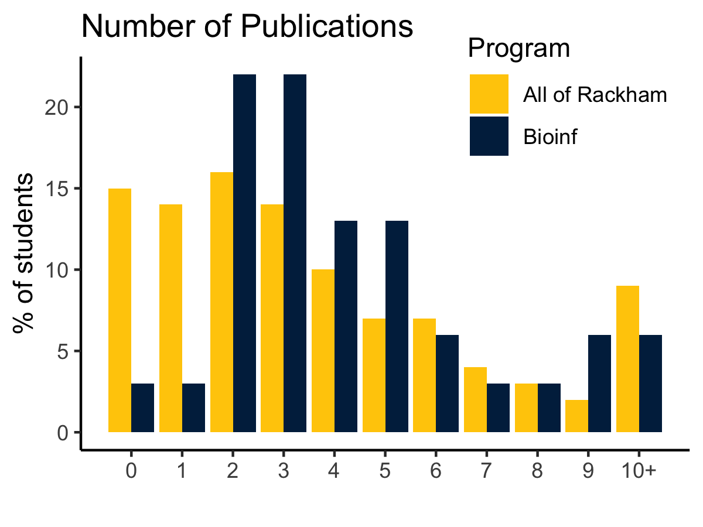
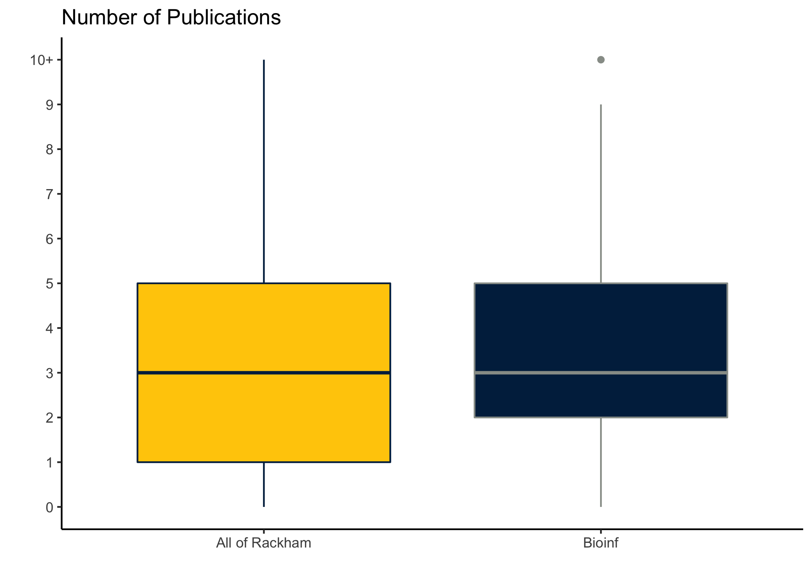

Bioinf student pubs vs. all of Rackham
================
Kelly Sovacool
2021-06-09

## the original figure


## prep the data

``` r
library(tidyverse)
dat <- tribble(
  ~npubs, ~Bioinf, ~`All of Rackham`,
  0, 3, 15,
  1, 3, 14,
  2, 22, 16,
  3, 22, 14,
  4, 13, 10,
  5, 13, 7,
  6, 6, 7,
  7, 3, 4,
  8, 3, 3,
  9, 6, 2,
  10, 6, 9
) %>% 
  pivot_longer(c(Bioinf, `All of Rackham`), 
               names_to = "Program", values_to = "percent")
head(dat)
```

    ## # A tibble: 6 x 3
    ##   npubs Program        percent
    ##   <dbl> <chr>            <dbl>
    ## 1     0 Bioinf               3
    ## 2     0 All of Rackham      15
    ## 3     1 Bioinf               3
    ## 4     1 All of Rackham      14
    ## 5     2 Bioinf              22
    ## 6     2 All of Rackham      16

## make new plots

``` r
micolors <- c('#FFCB05', '#00274C')
add_layers <- function() {
  list(
    scale_fill_manual(values = micolors),
    labs(y = "% of students", x = "", title = "Number of Publications"),
    theme_classic(),
    theme(legend.position = c(0.8, 0.9))
  )
}
```

``` r
dat %>% 
  ggplot(aes(npubs, percent, fill = Program)) +
  geom_bar(stat = 'identity', position = 'dodge') +
  add_layers() +
  scale_x_continuous(breaks = 0:10, labels = c(0:9, "10+"))
```



``` r
dat %>% 
  ggplot(aes(Program, npubs, weight = percent, 
             fill = Program, color = Program)) +
  geom_boxplot() +
  add_layers() +
  scale_color_manual(values = c('#00274C', '#989C97')) +
  theme(legend.position = 'none')
```

    ## Warning in rq.fit.br(wx, wy, tau = tau, ...): Solution may be nonunique


